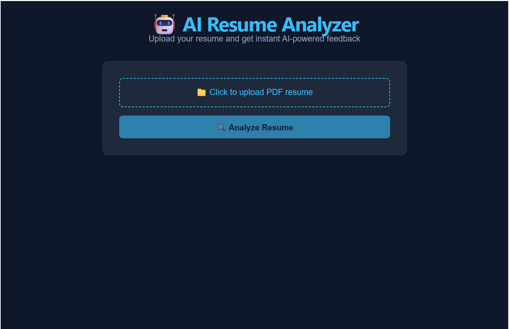
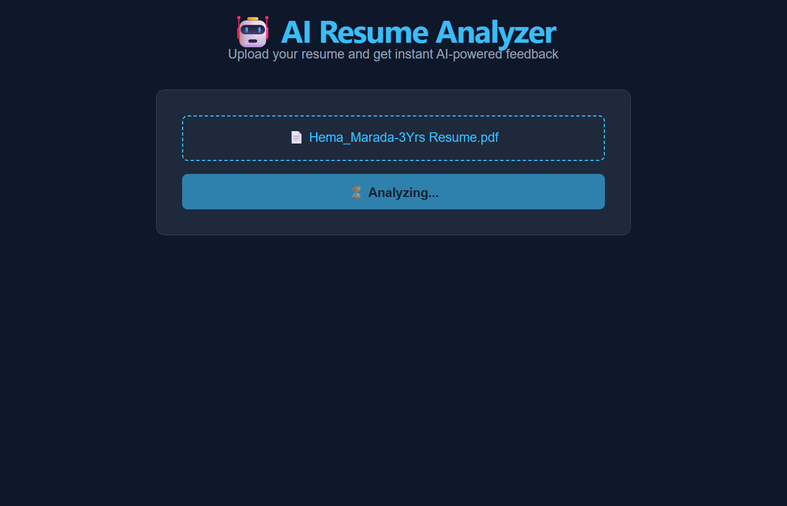
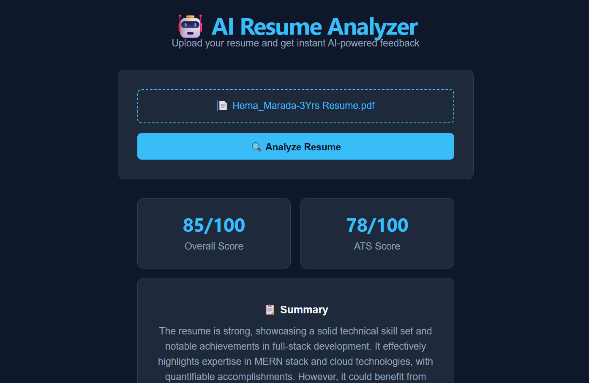

# AI Resume Analyzer

A full-stack web application that analyzes resumes using AI 
and provides instant feedback to improve ATS compatibility 
and recruiter appeal.

## Features
- Upload PDF resume
- AI-powered analysis using Cohere API
- Overall score and ATS compatibility score
- Strengths, improvements, and missing keywords
- Actionable suggestions

## Tech Stack
**Frontend:** React.js, TypeScript, Vite, Axios  
**Backend:** Node.js, Express.js, Multer, PDFReader  
**AI:** Cohere Command API  
**Tools:** Git, GitHub, VS Code, Postman

## Getting Started

### Backend
cd server
npm install
# Add COHERE_API_KEY to .env
node index.js

### Frontend
cd client
npm install
npm run dev

## Screenshots

## Author
Hema Marada — Full Stack Developer (MERN)  
[LinkedIn](https://linkedin.com/in/hema-marada02) | 
[GitHub](https://github.com/hema-marada25)